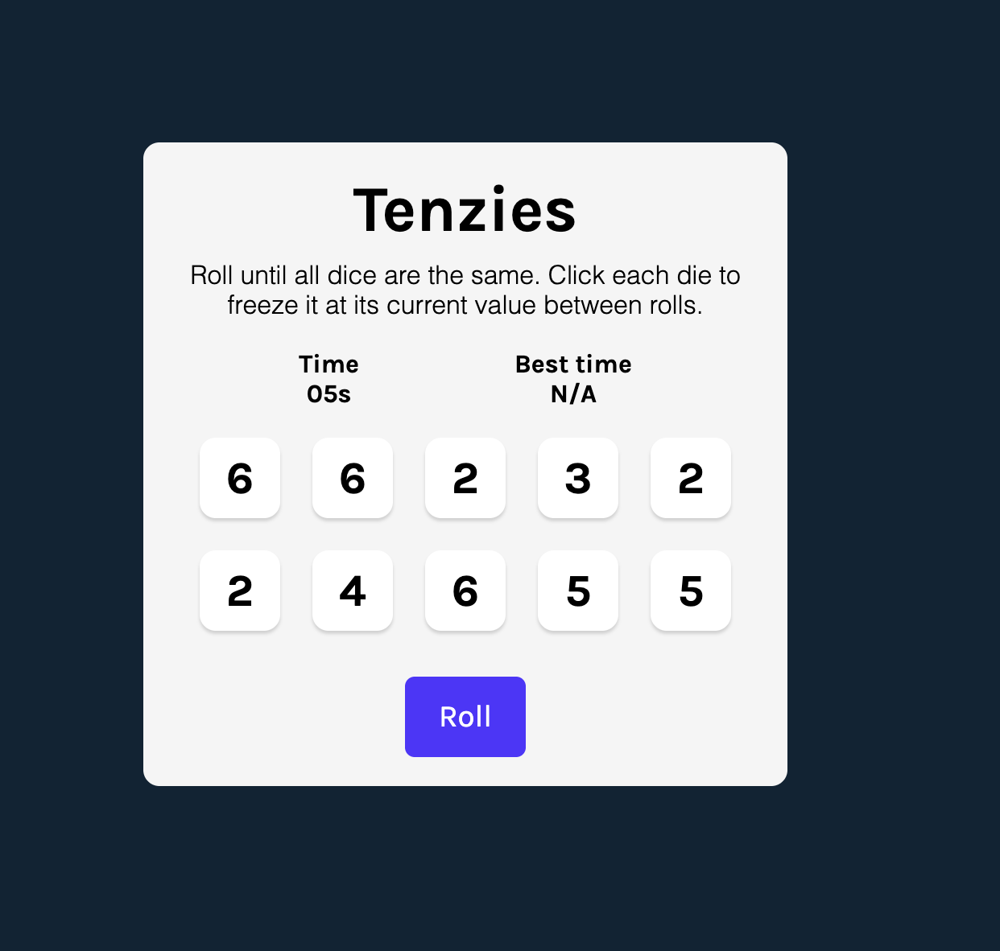

# Tenzies

A simple dice game built with React and Vite.

## Live Demo
[Play Tenzies Online](https://tenzieszs.netlify.app/) 

---

## Description
Tenzies is a fun and quick dice game. Roll the dice until all dice show the same number. Click a die to hold its value between rolls. Try to win in the shortest time possible!

---

## Features
- Roll 10 dice at once
- Hold dice to keep their value
- Timer to track your best time
- Confetti celebration when you win
- Responsive and simple UI

---

## Technology Used
- React
- Vite
- JavaScript (ES6)
- CSS

---

## Preview



---

## Getting Started

1. Clone the repo:
   ```sh
   git clone https://github.com/your-username/tenzies.git
   ```
2. Install dependencies:
   ```sh
   npm install
   ```
3. Start the development server:
   ```sh
   npm run dev
   ```
4. Open [http://localhost:5173](http://localhost:5173) to view it in your browser.

---

## License
This project is open source and available under the [MIT License](LICENSE).
